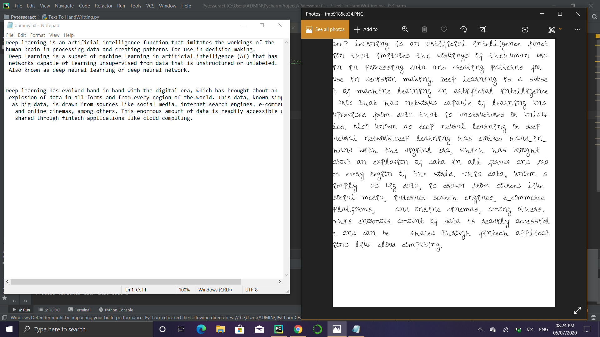

# Convert Text-to Handwriting Using Python

In this project we'll use python library that's "pywhatkit"  for converting text to handwriting. this small project you will know how python convert text to handwriting in image format.
# Demo

## Explanation
- Step 1
- Step 2
- Step 3
## Soruce Code
- [Download](https://drive.google.com/file/d/1cWIfTZ-t6TQ0CRCmrALZ-loa21YqEdJO/view?usp=sharing)

# Contribution Guidelines

If you have got an optimized solution to a problem or, lets say, the existing solution is failing on some test cases and you got a working solution, then there is really a high chance of getting you pull request being accepted. 
**Note:** If you have got an optimised solution, but the existing solution is also working, then:
1. Make another file in the corresponding folder'
2. Name it `<problem name in snake case>-<your name in snake case>-Optimized.cpp`.
3. Generate a pull request and wait.
